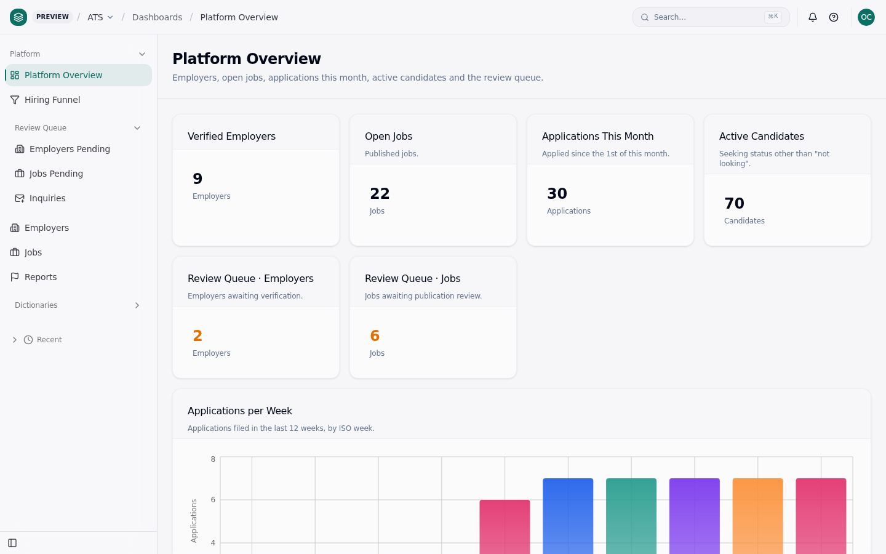
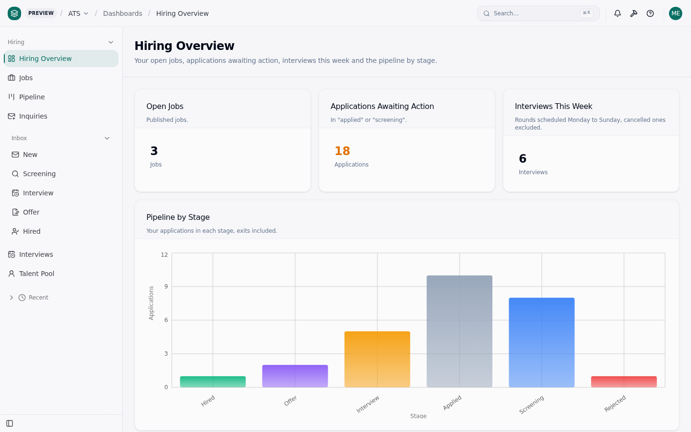
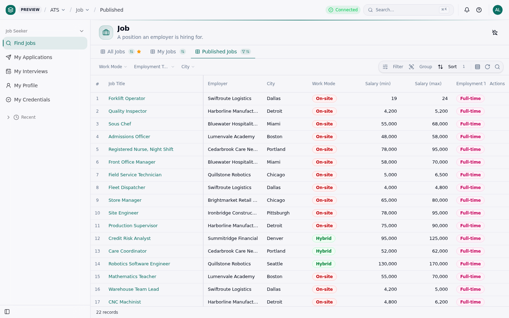
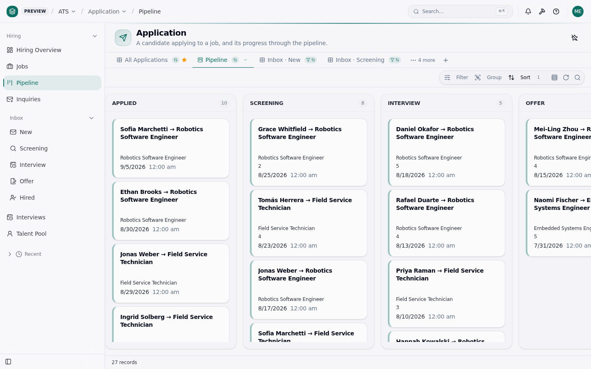
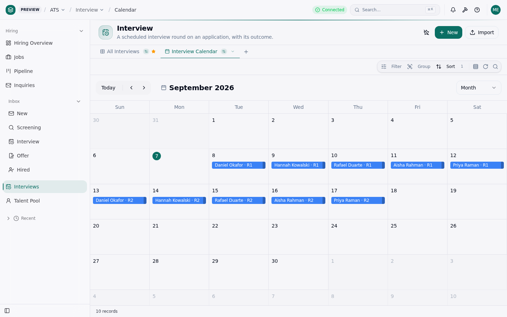
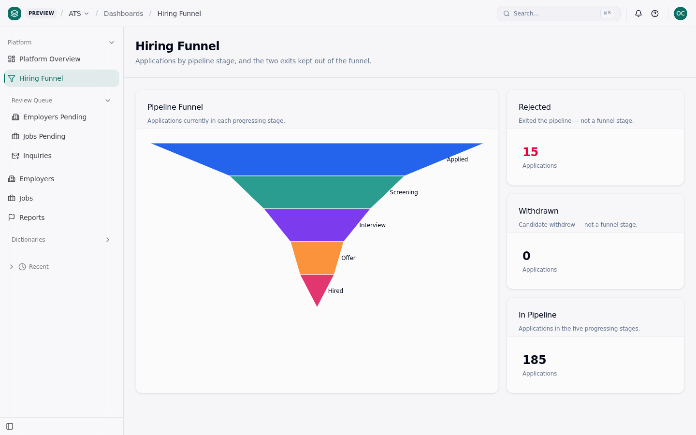

# ATS

**An open-source recruiting marketplace built on [ObjectStack](https://github.com/objectstack-ai/objectstack).**
Employers post jobs, candidates apply, the platform governs — modelled as typed metadata: objects,
permissions, approval flows, views, dashboards and two locales in one readable repository.

**一个建在 ObjectStack 上的开源平台型招聘应用。** 多雇主入驻、候选人求职、平台方治理，全部是类型化元数据。

[](https://github.com/objectstack-ai/ats/actions/workflows/ci.yml)

```bash
git clone https://github.com/objectstack-ai/ats.git && cd ats
pnpm install
pnpm dev          # REST + Console on http://localhost:3000/_console/ — sign in as admin@quillstone.example / demo1234
```

There is **no hosted demo yet** — nothing is deployed, so there is no link to give you; the three commands
above are the way to try it, and they boot the 818-row demo seed (the fresh-clone timing is measured in
the card-14 pull request, not asserted here). What you get is one app with three audiences, each seeing
exactly the navigation group its position unlocks:

| | | |
|:--|:--|:--|
| [](docs/screenshots/01-platform-home-overview.png) | [](docs/screenshots/03-hiring-home-overview.png) | [](docs/screenshots/06-seeker-home-find-jobs.png) |
| **Platform** — review queues, funnel, dictionaries | **Hiring** — an employer's pipeline, scoped to its rows | **Job Seeker** — published jobs, own applications |
| [](docs/screenshots/04-hiring-pipeline-kanban.png) | [](docs/screenshots/05-hiring-interview-calendar.png) | [](docs/screenshots/02-platform-hiring-funnel.png) |
| Pipeline kanban, grouped by stage | Interview calendar | Hiring funnel — 88 / 46 / 28 / 14 / 9 |

All shots on the memory driver with the demo seed; the persona, URL and numbers behind each are in
[`docs/screenshots/`](./docs/screenshots/README.md). The same screens render in Chinese when the browser
asks for `zh-CN` ([`07-…-zh-CN.png`](docs/screenshots/07-hiring-pipeline-kanban-zh-CN.png)).

> Status: **M4 — release.** The data model, permissions, views, one app, six flows and three dashboards
> are in; see [DESIGN.md](./DESIGN.md) for the model, [known gaps](#known-gaps) for what is measured and
> not yet right, and [docs/backlog](./docs/backlog/README.md) for what came in which card.

## What it is

- **Platform-shaped, not single-company** — many employers, one platform operator, hard row-level isolation between employers.
- **Three audiences, one metadata set** — platform ops, employer, job seeker each get their own navigation group over the same objects.
- **Credentials are first-class** — "licensed to practise, re-certified before expiry" is core, not a plugin.
- **Industry-neutral by rule** — no vertical vocabulary in the schema; industries live in seed data only.
- **Two locales** — every label, option, section, message and navigation item exists in `en` and `zh-CN`, and `pnpm lint` fails when one is missing, or when an `en` entry stops matching the label its metadata declares.

## Quick start

```bash
pnpm install
pnpm dev          # REST + Console on http://localhost:3000
```

Open <http://localhost:3000/_console/> and sign in with one of the [demo logins](#demo-logins). The `dev`
script boots with the demo seed (`src/data/`, English by default — `OS_SEED_LOCALE=zh pnpm dev` for the
Chinese set) and declares the platform owner: it sets `OS_PLATFORM_OWNER_EMAIL=admin@objectos.ai`, which
is what gives that account platform-admin standing once the seed's people exist (without it the runtime's
first-account carve-out stays shut and the dev admin is an ordinary user who can administer nothing). On
Windows `cmd`, set the variable in the shell before running `objectstack dev --ui`.

> **Run the demo on `--database-driver memory`** (`pnpm dev --database-driver memory`). On the default
> driver the four tenancy-scoped objects (`ats_employer`, `ats_employer_member`, `ats_interview`,
> `ats_offer`) return no rows to the platform personas, so the Platform group's review queues look empty.
> The employer and seeker personas are unaffected. Cause and evidence:
> [#39](https://github.com/objectstack-ai/ats/issues/39) (upstream
> [objectstack#16589](https://github.com/objectstack-ai/objectstack/issues/16589)).

**The demo seed loads in development mode only.** Every seed under `src/data/` is scoped
`env: ['dev', 'test']`, and the seed loader reads the mode from `NODE_ENV`: `objectstack dev` (what
`pnpm dev` runs) sets `NODE_ENV=development` and seeds; `objectstack start` and `objectstack serve`
set `NODE_ENV=production` when it is unset and seed **nothing** — no ATS rows, no demo logins — and
say so on one warning line under the startup banner (`[ats] demo seed skipped: NODE_ENV=production …`).
A production database therefore never receives the fictional people or their published passwords.
To load the demo into a production-mode boot on purpose, export `NODE_ENV=development`
(the CLI documents `NODE_ENV=development objectstack start`). Details and evidence:
[`src/data/demo-seed-gate.ts`](./src/data/demo-seed-gate.ts).

### Demo logins

**These are fictional demo accounts in a public repository. The passwords are documented here on
purpose and are not secrets.** They exist **only when the demo seed loads — `NODE_ENV=development`
(or `test`), which `objectstack dev` / `pnpm dev` set**; under `objectstack start`, `objectstack serve`
or `NODE_ENV=production` none of these rows is created and every sign-in below answers
`Invalid email or password`. Each persona is served exactly the navigation group its position unlocks
(DESIGN.md §04); the shared password is `demo1234`. They are defined in
[`src/data/shared/personas.ts`](./src/data/shared/personas.ts).

| Boot | `NODE_ENV` the CLI pins | Demo rows | These logins |
|---|---|---|---|
| `pnpm dev` · `objectstack dev` | `development` (when unset) | 818 seeded | work |
| `objectstack start` · `objectstack serve` | `production` (when unset) | none | do not exist |
| `NODE_ENV=development objectstack start` | as exported | 818 seeded | work — deliberate opt-in |

| Sign in as | Password | Who | Sees |
|---|---|---|---|
| `admin@objectos.ai` | `admin123` | Platform owner (`OS_PLATFORM_OWNER_EMAIL`) | Setup and the ATS app; holds no ATS position, so no ATS group — use the personas below for the product |
| `admin@platform.example` | `demo1234` | Platform administrator | **Platform** group, all data |
| `ops@platform.example` | `demo1234` | Platform operations | **Platform** group, review queues |
| `admin@quillstone.example` | `demo1234` | Employer administrator, Quillstone | **Hiring** group |
| `talent1@quillstone.example` | `demo1234` | Recruiter, Quillstone | **Hiring** group |
| `admin@harborline.example` | `demo1234` | Employer administrator, Harborline | **Hiring** group |
| `candidate01@mail.example` | `demo1234` | Job seeker | **Job Seeker** group |

Employer isolation works: signed in as Quillstone you see 5 jobs, 27 applications, 3 offers,
3 team members and 2 inquiries; as Harborline, 5 / 31 / 4 / 3 / 2 — and neither sees a single row of
the other's.

### The public application form

Anyone — no account, no cookie — can apply to a published job at
`/_console/f/apply?prefill_job=JOB_ID` (open a published job and use **Public Apply Link**), or by
`POST /api/v1/forms/apply/submit`. The submission lands in `ats_inquiry`, a quarantine object nobody
browses; the platform or the employer that owns the job converts it (**Convert to Application** on the
inquiry) into a candidate and an application — a repeat inquiry from the same e-mail attaches to the
existing candidate. The anonymous write is authorised by the form declaration itself, not by a guest
permission set (DESIGN.md §04).

## Known gaps

Each one is measured, with the measurement in the issue. None is hidden by the demo.

- [#39](https://github.com/objectstack-ai/ats/issues/39) — on the default (sqlite) driver the four
  tenancy-scoped objects (`ats_employer`, `ats_employer_member`, `ats_interview`, `ats_offer`) return
  no rows to a session whose active organization is the Default Organization. Since the app declares
  `membershipPolicy: 'invite-only'` that is the platform **owner** (`admin@objectos.ai`) alone; the
  `admin@platform.example` and `ops@platform.example` personas hold no membership and read all four on
  either driver. Sign in as those two, or run the demo on `--database-driver memory`
  (upstream [objectstack#16589](https://github.com/objectstack-ai/objectstack/issues/16589)).
- [#45](https://github.com/objectstack-ai/ats/issues/45) — an employer administrator cannot yet
  *create* a job (blocked upstream on
  [objectstack#16607](https://github.com/objectstack-ai/objectstack/issues/16607) and
  [#16608](https://github.com/objectstack-ai/objectstack/issues/16608)).
- [#56](https://github.com/objectstack-ai/ats/issues/56) — the two scheduled reminders (credential
  expiry, interview T-24h) select, mark and de-duplicate correctly but **deliver nothing** on the
  cron path, because a scheduled run carries no organization and the inbox write is refused on a
  multi-organization install (upstream
  [objectstack#16659](https://github.com/objectstack-ai/objectstack/issues/16659)). The
  stage-change notification (F4) is unaffected — it runs from a user session and does deliver.

## Languages

The metadata ships in two locales, `en` (the source language of every inline label) and `zh-CN`
([`src/translations/`](./src/translations/)), with the vocabulary `DESIGN.md` fixes — 岗位 · 投递 · 面试 ·
Offer · 候选人 · 雇主. The Console follows the browser's language, so a `zh-CN` browser gets Chinese
navigation, objects, views, columns and options over the same data. `pnpm lint` fails when a translatable
key lacks either locale. The demo *rows* are a separate switch: `OS_SEED_LOCALE=zh pnpm dev` loads the
Chinese seed set instead of the English one.

## Running it elsewhere

- **Container** — a [`Dockerfile`](./Dockerfile) and a [`docker-compose.yml`](./docker-compose.yml)
  build the app and the runtime into one image on sqlite. **They are authored, not yet verified**: no
  Docker daemon was available where they were written, so the commands they run were exercised natively
  but the image itself has not been built or run — build it once before relying on it. Their headers
  say what was measured and why the image is not the blank template's two-stage shape (the artifact
  alone does not carry this app's row-level-security resolver).
- **Production mode** — `pnpm start` (`objectstack start`) boots without the demo seed: an empty
  database, no fictional employers, no `demo1234` logins. `OS_PLATFORM_OWNER_EMAIL` names the account
  that receives platform-admin standing once it exists; how the first account is created on an empty
  install has not been exercised in this repository yet.

## Verify your work

Every metadata change is gated, locally and in [CI](./.github/workflows/ci.yml):

```bash
pnpm validate     # protocol schema + CEL predicates + bindings
pnpm lint         # data-model conventions (ADR-0090 vocabulary, titles, master-detail) + zh-CN parity
                  # + en.ts source parity (pnpm check:i18n-source, runnable on its own)
pnpm typecheck
```

## Layout

| Path | Contents |
|---|---|
| `objectstack.config.ts` | `defineStack()` — the single entry point |
| `src/objects/` | `ats_*` business objects |
| `src/views/` · `src/apps/` · `src/dashboards/` · `src/datasets/` | Views, the one app with its three navigation groups, three dashboards and the semantic layer behind them |
| `src/flows/` · `src/hooks/` · `src/actions/` · `src/security/` | F1–F6 automation, stamp hooks, inquiry triage, positions / permission sets / RLS / FLS |
| `src/translations/` | `en` and `zh-CN` bundles |
| `src/data/` | Demo seed — `demo-en/`, `demo-zh/`, and the gate that keeps it out of production |
| `docs/screenshots/` · `docs/evidence/` | The shots above and the measurements behind earlier cards |
| `DESIGN.md` | Architecture authority — objects, isolation model, apps, automation, milestones |
| `AGENTS.md` · `CONTRIBUTING.md` | Conventions for humans and coding agents; how to contribute |
| `docs/backlog/` | Dispatch-ready work cards (each file is an issue body) |

## Contributing

Read [CONTRIBUTING.md](./CONTRIBUTING.md): the gates, the card workflow, `DESIGN.md` as the architecture
authority, and the one rule people trip over — no vertical vocabulary anywhere in the schema.

## License

Apache-2.0 — see [LICENSE](./LICENSE).
